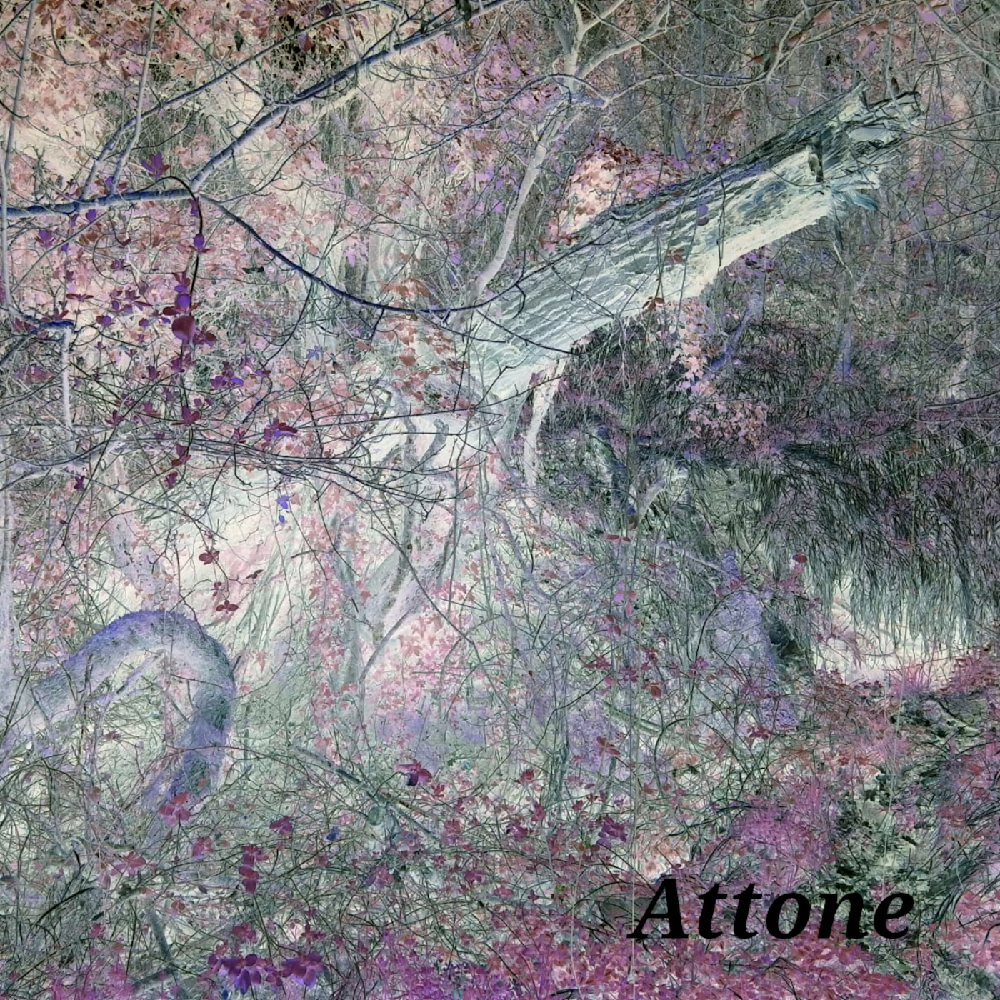
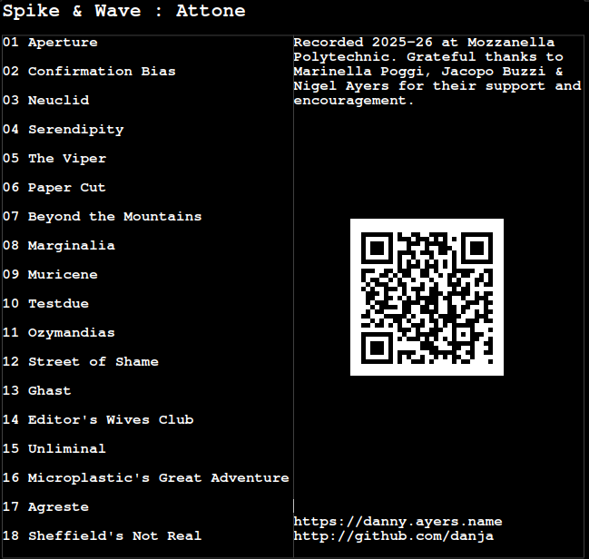

# Attone

by *Spike & Wave*

**Status 2024-04-14 :** sounds *probably* done, cover art, proper release etc. still to do.

[Tracks on YouTube](https://www.youtube.com/playlist?list=PLcI4DK1XcRAHjA180H0dYr7Dvaju027RV)

## Content

* [Audio Files](wav16) (16 bit stereo, 44.1 kHz)
* [Colophon](/docs/colophon.md)

## Sleeve

<<<<<<< HEAD
Material provided here for personal use only, all rights reserved, (c) [Danny Ayers](https://danny.ayers.name) 2026
=======
## Links

* Most music code experiments : https://github.com/danja/flues
* Daisy Seed projects : https://github.com/danja/daisy-maybe

*the following might not be live at the moment, I'm lousy at budgeting*

* My homepage : https://danny.ayers.name
* Some previous projects : https://hyperdata.it
* Something else : https://strandz.it

Material provided here for personal use only, all rights reserved, (c) Danny Ayers 2026
>>>>>>> 297975c3746bfb1fd735b49589818ea1deac4ab7
